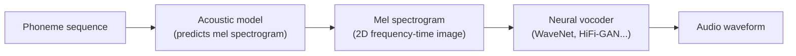
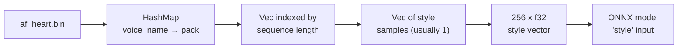
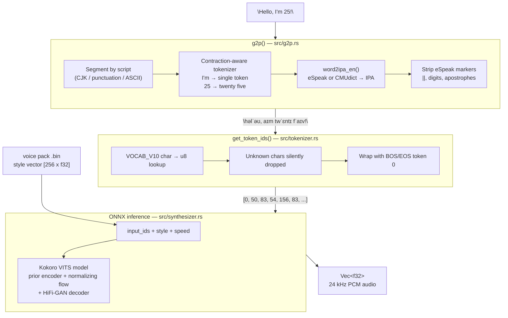

# Why Kokoro Never Sees Your Text

## If you are brand new: read this first

If terms like **G2P**, **IPA**, **token**, **tensor**, and **VITS** are new to you, that is completely normal.  
This guide is technical, but you can understand it with one simple mental model:

- A TTS system is like a music performer that only reads **sheet music**, not song lyrics.
- In Kokoro, the \"sheet music\" is **IPA phonemes** (sound symbols).
- Your normal text (English words) must first be translated into this sound sheet.

That translation step is **G2P**.

If the sheet music is wrong, the performer still performs confidently — just incorrectly.

---

## Tiny glossary (plain language)

- **TTS (Text-to-Speech)**: software that turns text into spoken audio.
- **G2P (Grapheme-to-Phoneme)**: converting written text into pronunciation symbols.
- **Grapheme**: written symbol (like letters in a word).
- **Phoneme**: the smallest sound unit in speech.
- **IPA (International Phonetic Alphabet)**: a universal alphabet for speech sounds.
- **Tokenizer**: converts symbols into numeric IDs the model can process.
- **Token ID**: number that stands for one symbol (for Kokoro, one phoneme symbol).
- **Tensor**: a numeric array passed into/out of neural models.
- **ONNX model**: the neural network file format used here for inference.
- **Inference**: running the model to produce output (audio), not training.
- **VITS**: a neural TTS architecture that maps phoneme tokens to waveform audio.

---

## The short answer

Kokoro is a neural network trained to turn **phoneme sequences** into **audio waveforms**. It has never learned what the letter `A` looks like, or that `"through"` and `"threw"` sound similar. It only knows: given this sequence of mouth-positions and sound units, produce this sound. The text-to-speech process therefore has two entirely separate stages:

1. **You** (or the G2P layer) figure out how the text should sound, expressed as IPA symbols.
2. **The model** turns those IPA symbols into audio.

If step 1 is wrong, step 2 produces faithfully wrong audio — and the model has no way to know or correct it.

---

## One concrete example (end-to-end)

Let us use this sentence:

`"Hello, I'm 25."`

At a high level:

1. G2P converts it to pronunciation symbols (roughly):
   - `hello` -> `həlˈəʊ`
   - `I'm` -> `aɪm`
   - `25` -> `twenty five` -> `twˈɛnti fˈaɪv`
2. Tokenizer turns each symbol into numbers.
3. Kokoro model turns those numbers into waveform samples.

If G2P makes even one bad conversion (for example `25` converted to Chinese numerals, or `I'm` split into weird parts), the model still generates audio — but it speaks the wrong thing.

---

## What is IPA and why does it matter here

**IPA** — the International Phonetic Alphabet — is a writing system that represents sounds directly rather than spelling conventions. One symbol = one sound, always, in every language.

English spelling is notoriously unpredictable:

| Written | Sounds like | IPA |
|---------|-------------|-----|
| `through` | "throo" | `θɹuː` |
| `though` | "tho" | `ðəʊ` |
| `tough` | "tuff" | `tʌf` |
| `cough` | "koff" | `kɒf` |
| `bough` | "bow" | `baʊ` |

These five words all end in `ough` but produce five completely different sounds. A neural network that trains on letter sequences directly would need to memorize all these exceptions. A network that trains on IPA sequences does not — because in IPA each sequence already encodes the sound precisely.

Kokoro was trained exclusively on IPA. That is its native language. It has no concept of orthography.

---

## The VITS family: what kind of model is this

Kokoro is based on the **VITS** architecture (Variational Inference with adversarial learning for end-to-end Text-to-Speech, Kim et al. 2021). Understanding VITS requires understanding what problem it was designed to solve.

If that sentence feels heavy: you can think of VITS as a model design that lets Kokoro go **from phoneme IDs directly to waveform audio**, instead of first creating an intermediate spectrogram with a separate model.

### Earlier TTS architectures required two models

Traditional pipeline TTS looked like this:



The **acoustic model** (e.g. Tacotron 2) learned to predict a mel spectrogram — a 2D representation of which frequencies are loud at each moment in time. Then a separate **vocoder** converted that spectrogram into actual audio samples.

Each of these models had to be trained separately, and errors in the spectrogram compounded in the vocoder. Spectrogram representations also throw away phase information, which the vocoder had to reconstruct — an inherently lossy process.

### VITS does it in one model

VITS combines both steps into a single end-to-end architecture using **variational autoencoders** and **normalizing flows**:

```mermaid
flowchart TD
    subgraph training ["Training (offline)"]
        audio_in["Real audio\n(waveform)"] --> posterior["Posterior encoder\nlearns: what latent z\nproduces this audio?"]
        posterior --> z_train["Latent representation z"]
    end

    subgraph inference ["Inference (your call to .synth())"]
        phonemes["Phoneme token IDs\n[0, 50, 83, 54, ...]"] --> prior["Prior encoder + flow\nlearns: predict z from phonemes"]
        style["Style vector\n(voice pack, 256 floats)"] --> prior
        speed["Speed scalar"] --> prior
        prior --> z_infer["Latent representation z"]
        z_infer --> decoder["HiFi-GAN decoder\nz → audio samples"]
        decoder --> waveform["Waveform\nVec&lt;f32&gt; at 24 kHz"]
    end
```

During training the model learned to compress real audio into a latent space `z`, and simultaneously to predict that same `z` from phonemes. During inference only the right half runs — phonemes go in, audio comes out directly.

The key insight: there is no intermediate spectrogram. The model maps phoneme IDs → latent space → raw audio in one forward pass.

---

## What the model actually receives

When you call `tts.synth("Hello, world!", Voice::AfHeart(1.0))`, the ONNX session receives three tensors:

| Input name | Shape | Contents |
|------------|-------|----------|
| `input_ids` | `[1, N]` | Integer token IDs, one per IPA character |
| `style` | `[1, 256]` | The voice style vector (from the `.bin` pack) |
| `speed` | `[1]` | Speed multiplier as `f32` |

And it returns:

| Output name | Contents |
|-------------|----------|
| `waveform` | `Vec<f32>` — raw PCM audio at 24 000 Hz |

In `src/synthesizer.rs`:

```rust
let kokoro_output = model.run_async(
    inputs![
        "input_ids" => TensorRef::from_array_view(&phonemes)?,
        "style"     => TensorRef::from_array_view(&style)?,
        "speed"     => TensorRef::from_array_view(&speed)?,
    ],
    &options,
)?.await?;
let (_, audio) = kokoro_output["waveform"].try_extract_tensor::<f32>()?;
```

There is no `text` input. There is no `language` input. Just those three tensors.

This is the key beginner takeaway:

- Kokoro does not parse spelling.
- Kokoro does not do grammar.
- Kokoro does not decide pronunciation.
- Kokoro only renders the pronunciation sequence it was given.

---

## What the token IDs actually are

The `input_ids` tensor is not BPE tokens (like GPT uses), word embeddings, or character byte indices. It is a flat **phoneme symbol vocabulary** where each entry is a specific IPA character. Looking at `VOCAB_V10` in `src/tokenizer.rs`:

```
' '  → 16    (word boundary)
'ˈ'  → 156   (primary stress)
'ˌ'  → 157   (secondary stress)
'ː'  → 158   (long vowel marker)
'ə'  → 83    (schwa — the "uh" sound)
'ɹ'  → 123   (English R)
'θ'  → 119   (voiceless TH)
'ð'  → 81    (voiced TH)
'ŋ'  → 112   (NG as in "sing")
','  → 3     (short pause)
'.'  → 4     (sentence-final pause)
'!'  → 5     (exclamatory pause)
```

The vocabulary has ~100 entries. Every other character, including all letters of the alphabet, digits, eSpeak control markers, and Chinese characters that leaked into the English path, maps to nothing and is silently dropped.

This is why clean G2P output is critical: the model cannot recover from a missing or wrong phoneme. Each token ID directly encodes one specific sound. Swapping `ð` (voiced TH) for `θ` (voiceless TH) does not cause an error — it produces clearly incorrect speech.

---

## Where the voice character comes from

The `style` vector is what makes `AfHeart` sound different from `AmAdam`. It is a 256-dimensional float vector loaded from the `.bin` pack file.

But it is not a single fixed vector. The pack stores one vector per phoneme sequence length:

```rust
// src/synthesizer.rs
let ref_s = pack.as_ref()[phonemes.len() - 1]   // ← indexed by sequence length
    .first()
    .cloned()
    .unwrap_or_default();
```

This is the **style conditioning** mechanism from VITS. Different style vectors at different sequence lengths allow the model to adapt its prosody (rhythm, pitch, emphasis) to the length of what is being said. A longer sentence needs different pacing than a short one. The pack encodes this mapping.

The pack itself is loaded from a `.bin` file — a `bincode`-serialized `HashMap<String, Vec<Vec<Vec<f32>>>>`:

- Outer map key: voice name (`"af_heart"`)
- First dimension: sequence length index
- Second dimension: style sample index (usually 1)
- Third dimension: 256 floats (the style embedding)



---

## Why G2P is where everything can go wrong

The model is already trained and frozen. Its weights do not change at runtime. The only thing you can influence is what goes into `input_ids` and `style`. `style` is fixed per voice. That means **G2P is the only lever you have**.

For beginners, a practical framing:

- If voice is robotic or wrong words appear, first inspect **G2P output**.
- If G2P output looks clean IPA, then inspect tokenizer/vocabulary mismatch.
- The neural model is rarely the first bug source during integration.

Errors in G2P fall into three categories, each causing a distinct type of audio problem:

### 1. Missing tokens (silent drops)

The tokenizer silently drops any character not in the vocabulary:

```rust
match v {
    Some(t) => tokens.push(t as _),
    _ => { warn!("Unknown phone {}, skipped."); }
}
```

The model receives a shorter sequence and tries to fill the time with what comes before and after. This causes sounds to be slurred together or words to seem truncated. Example: the eSpeak `||` separator caused `ɐ||wˈaɪl` to drop to `ɐwˈaɪl` — the model synthesized something that sounded like the word "awhile".

### 2. Wrong tokens (substituted sounds)

If `ð` (voiced *"th"* as in "the") is substituted with `d`, the model faithfully synthesizes a `d` sound. The word "the" becomes "de". This class of error comes from incorrect phoneme backend output (eSpeak producing a wrong transcription) or from character stripping that removes diacritics.

### 3. Extra tokens (hallucinated sounds)

If extra characters that happen to be in the vocabulary reach the tokenizer, the model will synthesize them. The Chinese numeral `二十五` contains characters that match some Chinese-language tokens in `VOCAB_V11`, producing unexpected syllables in the output. In `VOCAB_V10` they were dropped, but their presence still disturbed the sequence length and therefore the style vector selection.

```mermaid
flowchart TD
    bad_g2p["Dirty G2P output:\n\"ɐ||wˈaɪl 二十五 jˈiəɜ\""]
    bad_g2p --> tokenizer["get_token_ids()"]
    tokenizer --> drop["'|', '|' → dropped\n(not in vocab)"]
    tokenizer --> keep1["ɐ → 70\nw → 65\nˈ → 156\na → 43\nɪ → 102\nl → 54"]
    tokenizer --> cjk["二, 十, 五 → dropped\n(not in VOCAB_V10)"]
    keep1 --> shorter_seq["Shorter sequence\nthan intended"]
    shorter_seq --> wrong_style["Wrong style vector\nselected (wrong length index)"]
    wrong_style --> model["Model synthesizes\nwith wrong prosody"]
```

---

## The two backends: eSpeak vs CMUdict

`word2ipa_en()` has two compile-time implementations selected by a Cargo feature flag.

```
Cargo.toml:
[features]
use-cmudict = ["cmudict-fast"]
```

### Default: eSpeak (no feature flag)

eSpeak is a formant speech synthesizer with its own internal phoneme format. The implementation calls into a C library via FFI:

```rust
unsafe extern "C" {
    fn TextToPhonemes(text: *const c_char) -> *const c_char;
    fn Initialize(data_dictlist: *const c_char);
}
```

eSpeak's output format is **not IPA** — it uses eSpeak's own notation with:
- `||` to separate pronunciation variants (`haʊ||haʊ`)
- Digits for stress levels (`twˈɛntaɪ2fˈɪv` where `2` means secondary stress)
- Apostrophes as internal markers

None of these survive in Kokoro's vocabulary. The sanitization added in `word2ipa_en()` strips them:

```rust
let primary = raw.split("||").next().unwrap_or_default();
let mut cleaned = String::with_capacity(primary.len());
for ch in primary.chars() {
    match ch {
        '|' | '\'' => {}   // eSpeak markers
        '0'..='9'  => {}   // eSpeak stress digits
        _          => cleaned.push(ch),
    }
}
```

### With `use-cmudict`

CMUdict (Carnegie Mellon University Pronouncing Dictionary) is a curated pronunciation dictionary for English with ~135 000 entries. Each entry maps a word to one or more pronunciations expressed in **ARPAbet** — a different phoneme notation — which is then converted to IPA via `arpa_to_ipa()`.

```
CMUdict entry:  WORLD  W ER1 L D
ARPAbet → IPA:  W→w   ER1→ˈɜː  L→l  D→d
Result IPA:     wˈɜːld
```

CMUdict output is already in a format that maps cleanly to Kokoro's vocabulary with no sanitization needed. It also covers contractions, irregular plurals, and abbreviations by direct lookup rather than rule application, which makes it more accurate than rule-based fallbacks.

```mermaid
flowchart TD
    word["English word\n\"world\""]

    subgraph espeak_path ["Default: eSpeak path"]
        ffi["FFI → TextToPhonemes(\"world\")"]
        raw["Raw: \"wˈɜːld\" (or with markers)"]
        sanitize["Strip ||, digits, apostrophes"]
        clean1["Clean IPA: wˈɜːld"]
        ffi --> raw --> sanitize --> clean1
    end

    subgraph cmudict_path ["use-cmudict feature"]
        lookup["CMUdict lookup: WORLD → W ER1 L D"]
        convert["arpa_to_ipa() each phoneme"]
        clean2["Clean IPA: wˈɜːld"]
        lookup --> convert --> clean2
    end

    word --> espeak_path
    word --> cmudict_path
```

For words not in CMUdict, the fallback is `letters_to_ipa()` which spells each letter as its name — sufficient for acronyms but not for unknown words.

---

## v1.0 vs v1.1: different vocabularies for different languages

Kokoro ships two model generations with different vocabulary tables:

| | v1.0 | v1.1-zh |
|--|------|---------|
| Voices | `af_heart`, `am_adam`, `bf_emma`, ... | `Zf003`, `Zm029`, ... |
| Script | English / European IPA | Mandarin Bopomofo + IPA |
| Speed param | `f32` (e.g. `1.0`) | `i32` (integer scale) |
| Tone markers | IPA arrows `↓↗↘` | Digits `1 2 3 4 5` |
| Vocab size | ~100 IPA symbols | ~178 entries (Bopomofo + IPA) |

`VOCAB_V11` has entries that `VOCAB_V10` does not — Bopomofo characters like `ㄅ ㄆ ㄇ ㄈ` (the phonetic alphabet for Mandarin), tone digits `1`–`5`, and sandhi markers. It also lacks some pure-IPA symbols that `VOCAB_V10` has.

Sending v1.0 phonemes to a v1.1 model, or vice versa, produces garbage. The `Voice` enum encodes which vocabulary applies:

```rust
// src/synthesizer.rs
match voice {
    v if v.is_v11_supported() => synth_v11(model, phonemes, pack, v.get_speed_v11()?).await,
    v if v.is_v10_supported() => synth_v10(model, phonemes, pack, v.get_speed_v10()?).await,
    v => Err(KokoroError::VoiceVersionInvalid(v.get_name().to_owned())),
}
```

And `g2p()` is called with the correct mode flag:

```rust
let phonemes = g2p(text.as_ref(), voice.is_v11_supported())?;
```

---

## The complete picture

Putting it all together — the full path from your string to your speaker:



Every stage has a single responsibility:

- **G2P**: convert text to clean, vocabulary-compatible IPA
- **Tokenizer**: map IPA characters to integer IDs and wrap with BOS/EOS
- **Model**: map IDs + style → audio (this stage is fixed and cannot be changed)

The model is the most powerful part of the system and the least controllable. The only way to influence what it produces is to give it correct input.

---

## Debug checklist for newcomers

When speech sounds wrong, check these in order:

1. Print the phoneme string right before model inference.
2. Confirm numbers were expanded correctly (`25` -> spoken English words).
3. Confirm contractions stay intact (`I'm`, `don't`, `co-founder`).
4. Ensure no backend artifacts remain (`||`, stress digits, stray markers).
5. Check tokenizer warnings for unknown phoneme symbols.
6. Verify voice version and vocabulary match (`v1.0` vs `v1.1`).

If steps 1-6 are clean, then investigate model/voice-pack quality.

### G2P debugging helpers

- **[`g2p_audit`](src/g2p.rs)** returns the phoneme string plus any characters **not** present in the active tokenizer vocabulary (`unknown_phoneme_chars`). Use it to compare against another Kokoro port without relying on browser debug output.
- **CLI**: `cargo run --bin kokoro-g2p-audit -- "Hello, world."` — prints phonemes and unknown symbols. Set `KOKORO_G2P_V11=1` when auditing strings intended for v1.1 / Mandarin-capable models.
- **`KOKORO_G2P_LEXICON`**: path to a UTF-8 file of lines `word<TAB>ipa` (`#` comments, empty lines ignored). Overrides apply **before** CMUdict / eSpeak for that word form (case-insensitive key).
- **`KOKORO_G2P_TRACE=1`**: per-token source (`lexicon`, `dict`, `fallback`, `heuristic`) and IPA.
- **Homographs**: `read` / `read(2)` in CMUdict are chosen using a simple **past-marker** heuristic (`yesterday`, `ago`, `last`, … appearing earlier in the same sentence). Extend this pattern if you add more disambiguation later.

---

## Why the JavaScript implementation worked fine

The Kokoro JavaScript implementation (Kokoro.js / kokoro-web) runs the same ONNX model under the hood. What it does differently is the G2P step. It uses a JavaScript port of `espeak-ng` or a dedicated English phonemizer that outputs clean IPA directly — without the `||` variant separators or digit stress markers that the C FFI version emits in this library.

Same model weights. Same tokenizer vocabulary. Different G2P preprocessing. The audio quality difference between the two implementations was entirely in the 80 lines of `word2ipa_en()`.

This illustrates the central point: **the neural model is not the moving part. G2P is.**
