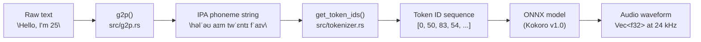
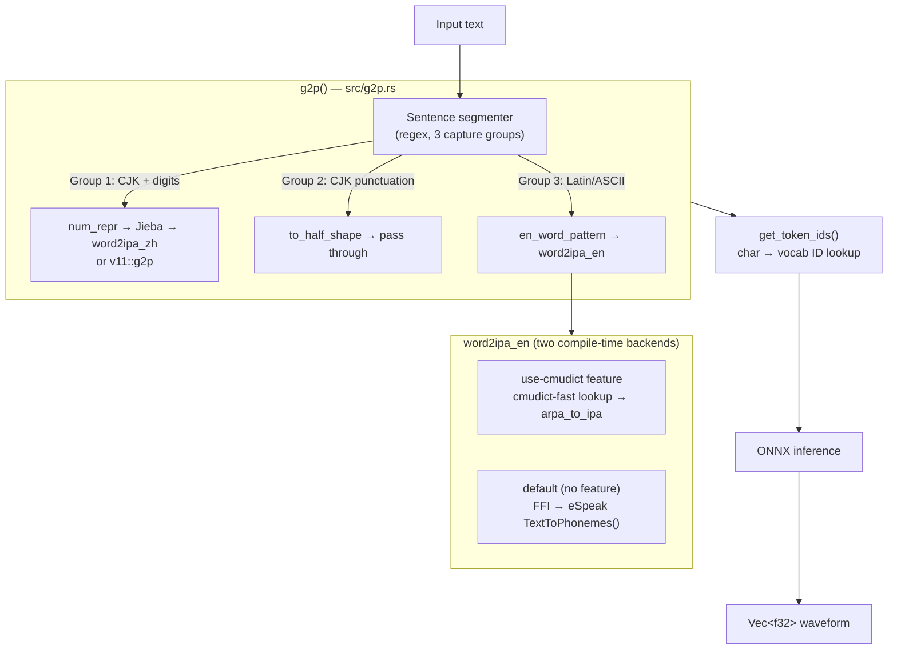
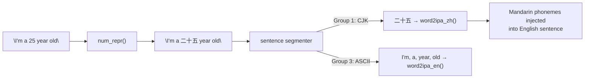

# English TTS Quality Issues in kokoro-tts: Root Causes and Fixes

This document describes the audio quality problems discovered while porting Kokoro TTS from a JavaScript implementation to this Rust library, their root causes in the G2P pipeline, and the exact code changes that resolved them.

---

## Background: How Kokoro TTS works

Kokoro is a neural text-to-speech model built around a VITS-family architecture. It takes IPA phoneme sequences as input — not raw text. This means the entire responsibility for producing correctly-spoken audio falls on the **Grapheme-to-Phoneme (G2P)** step that runs *before* the model is even called.



The model itself never sees text. If G2P produces wrong, missing, or contaminated phonemes, the model will either skip sounds, hallucinate unexpected words, or produce distorted output.

The library supports two voice model versions:

- **v1.0** (`af_heart`, `am_adam`, etc.) — English-focused voices, uses IPA with stress markers
- **v1.1-zh** (`Zf003`, etc.) — Mandarin/bilingual voices, uses a different phoneme encoding (Bopomofo + IPA)

The G2P path chosen at runtime depends on the `Voice` enum variant, so mismatches between G2P logic and voice selection compound problems.

---

## The pipeline in detail



---

## Problem 1: Numbers in English text were converted to Chinese

### Symptom

Sending `"I'm a 25 year old software engineer"` caused the model to produce Chinese-sounding speech mixed into the English output. Words appeared that were never in the input.

### Root cause

`g2p()` called `num_repr()` unconditionally at the very top, before any language detection:

```rust
// BEFORE — src/g2p.rs
pub fn g2p(text: &str, use_v11: bool) -> Result<String, G2PError> {
    let text = num_repr(text)?;  // ← runs on ALL input, English or Chinese
    // ...
}
```

`num_repr()` uses the `chinese-number` crate to replace every digit sequence with Traditional Chinese characters:

```rust
fn num_repr(text: &str) -> Result<String, G2PError> {
    let regex = Regex::new(r#"\d+(\.\d+)?"#)?;
    Ok(regex.replace(text, |caps: &Captures| {
        let text = &caps[0];
        if let Ok(num) = text.parse::<f64>() {
            num.to_chinese(
                ChineseVariant::Traditional,
                ChineseCase::Lower,
                ChineseCountMethod::Low,
            )
            .map_or(text.to_owned(), |i| i)
        } else { text.to_owned() }
    }).to_string())
}
```

So `"25"` became `"二十五"` regardless of whether the surrounding text was English. That Chinese string then matched the CJK regex group and was phonemized as Mandarin — producing sounds like *"èr shí wǔ"* instead of *"twenty-five"*.

### Data flow of the bug



### Fix

`num_repr()` is now gated: it only runs when the text segment actually contains CJK characters.

```rust
// AFTER — src/g2p.rs, inside the CJK branch of g2p()
let text = to_half_shape(text.as_str());
let text = if text.chars().any(|c| ('\u{4E00}'..='\u{9FFF}').contains(&c)) {
    num_repr(&text)?  // ← only for actual Chinese text
} else {
    text
};
```

The segment regex was also updated to include digits alongside CJK so that mixed Chinese+number strings (like `"2025年"`) still get handled in the CJK path:

```rust
// Group 1 now captures CJK characters AND digits that appear alongside them
r#"([\u4E00-\u9FFF\d]+)|([CJK punctuation]+)|([\u0000-\u00FF]+)+"#
```

---

## Problem 2: Digits in English flow produced empty or garbled phonemes

### Symptom

After fixing Problem 1, the number `25` in an English sentence was now hitting the English G2P path — but the eSpeak backend returned an empty string for `"25"` as input, since it expects a word, not a bare integer string.

Debug output before the fix:

```
25 -> Ok("")
```

### Root cause

`word2ipa_en()` was receiving the raw digit token `"25"` and passing it directly to `TextToPhonemes()`. eSpeak's phonemizer is designed for words, not numerals. The integer representation `"25"` produces an empty result. The tokenizer then silently skips every unknown character, so `25` simply vanished from the phoneme stream and was never spoken.

### Fix

A new `number_token_to_words_en()` function converts digit tokens to their English word equivalents before phonemizing:

```rust
fn number_token_to_words_en(token: &str) -> Option<String> {
    if token.chars().all(|c| c.is_ascii_digit()) {
        if let Ok(n) = token.parse::<u64>() {
            return Some(num_to_words_en_u64(n));  // "25" → "twenty five"
        }
        // Per-digit fallback for very large numbers
        let words = token.chars().filter_map(|c| match c {
            '0' => Some("zero"), '1' => Some("one"), /* ... */ _ => None,
        }).collect::<Vec<_>>().join(" ");
        return Some(words);
    }
    None
}
```

`num_to_words_en_u64()` handles the full range including hundreds, thousands, millions, and billions using a chunked word-building approach.

In `g2p()`, the English token dispatch now separates letters from digits explicitly:

```rust
if c.is_ascii_lowercase() || c.is_ascii_uppercase() {
    // regular word → word2ipa_en(token)
} else if c.is_ascii_digit() {
    if let Some(words) = number_token_to_words_en(token) {
        for word in words.split_whitespace() {
            result.push_str(&word2ipa_en(word)?);
            result.push(' ');
        }
    }
}
```

---

## Problem 3: Contractions were split and partially letter-spelled

### Symptom

`"I'm"` was being rendered as `"ˈI'ˈɛ2m"` — the `I` and `m` were phonemized separately as letter names ("eye", "em") and the apostrophe produced stray artifacts.

### Root cause

The English token regex was `\w+|\W+`. The `\w+` group matches word characters but stops at the apostrophe, so `"I'm"` was tokenized as three separate tokens: `"I"`, `"'"`, `"m"`. Then:

- `"I"` was short (1 char, uppercase), so it hit the `letters_to_ipa` shortcut — spelled as the letter name *"eye"*
- `"'"` was treated as a word-start character (`c == '\''`) and sent to `word2ipa_en()`
- `"m"` was separately phonemized as the letter *"em"*

```mermaid
flowchart TD
    A["\"I'm\""] --> B["\\w+|\\W+ tokenizer"]
    B --> C["\"I\""]
    B --> D["\"'\""]
    B --> E["\"m\""]
    C --> F["letters_to_ipa('I') = ˈI (letter name 'eye')"]
    D --> G["word2ipa_en(\"'\") = some artifact"]
    E --> H["word2ipa_en(\"m\") = ˈɛm (letter name 'em')"]
    F & G & H --> I["Concatenated: ˈI + artifact + ˈɛm"]
```

### Fix

The English token regex was replaced with a contraction-aware pattern:

```rust
let en_word_pattern = Regex::new(
    r"[A-Za-z]+(?:['-][A-Za-z]+)*|\d+(?:\.\d+)?|[^A-Za-z\d]+"
)?;
```

This pattern matches:
- `[A-Za-z]+(?:['-][A-Za-z]+)*` — a word optionally followed by one or more `'`- or `-`-joined word parts: `I'm`, `co-founder`, `it's`, `well-being` all match as single tokens
- `\d+(?:\.\d+)?` — integer or decimal numbers as a single token
- `[^A-Za-z\d]+` — everything else (punctuation, spaces) as a non-word token

Standalone `'` and `-` are no longer routed into `word2ipa_en()`. They fall into the punctuation branch and are passed through as-is.

---

## Problem 4: eSpeak backend leaked control markers into the phoneme stream

### Symptom

Even after fixing the three problems above, the phoneme log still contained noise:

```
phonemes=... ˈI'ˈɛ2m ɐ||wˈaɪl twˈɛntaɪ ...
```

Specifically:
- `||` — eSpeak's pronunciation variant separator
- `'` — eSpeak's secondary stress marker
- `2`, `0`-`9` digits — eSpeak's stress/tone level digits

None of these characters exist in the Kokoro tokenizer vocabulary (`VOCAB_V10` / `VOCAB_V11`). The tokenizer silently skips any character it does not recognise, so these artifacts either disappear mid-word (causing mispronunciation) or cause the surrounding phonemes to be read with wrong stress.

### How eSpeak's output format works

eSpeak's `TextToPhonemes()` C function returns a string in its own extended IPA notation:

```
wˈɜːld          ← normal case, no artifacts
haʊ||haʊ        ← two pronunciation variants, separated by ||
twˈɛntaɪ2fˈɪv   ← digit 2 = secondary stress marker inline
ɐm              ← after stripping apostrophe, contraction part
```

Kokoro's tokenizer vocabulary only contains clean IPA symbols and the specific stress marks `ˈ` (U+02C8) and `ˌ` (U+02CC). The digit stress levels and pipe separators are eSpeak-internal and must be stripped before tokenization.

### Fix

The raw eSpeak output is now sanitized before being returned from `word2ipa_en()`:

```rust
#[cfg(not(feature = "use-cmudict"))]
fn word2ipa_en(word: &str) -> Result<String, G2PError> {
    // ... initialization ...
    unsafe {
        let word = CString::new(word.to_lowercase())?.into_raw() as *const c_char;
        let res = TextToPhonemes(word);
        let raw = CStr::from_ptr(res).to_str()?.to_string();

        // Take only the primary pronunciation (before first ||)
        let primary = raw.split("||").next().unwrap_or_default();

        let mut cleaned = String::with_capacity(primary.len());
        for ch in primary.chars() {
            match ch {
                '|' | '\''  => {}   // eSpeak variant/stress markers
                '0'..='9'   => {}   // eSpeak digit stress levels
                _           => cleaned.push(ch),
            }
        }
        Ok(cleaned.trim().to_string())
    }
}
```

---

## Problem 5: Non-deterministic pronunciation selection (CMUdict path)

### Symptom

When built with the `use-cmudict` feature, repeating the same sentence across multiple runs produced audio that sounded slightly different each time — some words had unexpected stress or vowel quality.

### Root cause

CMUdict contains multiple accepted pronunciations for many common words. For example, `"either"` has both `IY1 DH ER0` (American) and `AY1 DH ER0` (British). The code was selecting among them randomly:

```rust
// BEFORE — use-cmudict path
let i = rand::random_range(0..rules.len());
let result = rules[i]
    .pronunciation()
    .iter()
    .map(|i| arpa_to_ipa(&i.to_string()).unwrap_or_default())
    .collect::<String>();
```

For a library that is supposed to produce consistent output this is wrong: the first call might sound American, the second British, with no way to predict or reproduce the result.

### Fix

Always use the first (primary) pronunciation entry:

```rust
// AFTER — use-cmudict path
let result = rules[0]
    .pronunciation()
    // ...
```

CMUdict's convention is that the first entry is the most common pronunciation. This makes output stable and reproducible.

---

## Summary of all changes

| # | File | Change | Effect |
|---|------|--------|--------|
| 1 | `src/g2p.rs` | Gate `num_repr()` on presence of CJK chars | English numbers stay English |
| 2 | `src/g2p.rs` | Add `number_token_to_words_en()` + `num_to_words_en_u64()` | `"25"` → `"twenty five"` before phonemization |
| 3 | `src/g2p.rs` | Replace `\w+\|\|W+` with contraction-aware token regex | `"I'm"`, `"co-founder"` treated as one token |
| 4 | `src/g2p.rs` | Strip `\|\|`, `\|`, `'`, and digit chars from eSpeak output | No tokenizer-invisible noise in phoneme stream |
| 5 | `src/g2p.rs` | Use `rules[0]` instead of `rand::random_range` in CMUdict path | Deterministic, reproducible pronunciation |
| 6 | `src/synthesizer.rs` | Uncomment + upgrade phoneme debug logging | Visibility into G2P output during development |

---

## Phoneme stream: before and after

The same input sentence across all three rounds of debugging:

```
text: "Hello, world! I'm a 25 year old software engineer with a passion background?"
```

**Before any fixes:**
```
həlˈəʊ, wˈɜːld! ˈI'ˈɛ2m ɐ||wˈaɪl 二十五 jˈiəɜ ˈəʊld sˈɔ2ftweə ...
```
Problems: Chinese numeral `二十五`, letter-spelled contraction `ˈI'ˈɛ2m`, eSpeak variant separator `||`, stress digit `2`.

**After fix 1–3 (numbers + contractions):**
```
həlˈəʊ, wˈɜːld! aɪm ɐ||wˈaɪl twˈɛntaɪ fˈɪvɛ jˈiəɜ ...
```
Progress: `I'm` now correct, `25` now expanded. Remaining: `||` and stress digits from eSpeak.

**After fix 4 (eSpeak sanitization):**
```
həlˈəʊ, wˈɜːld! aɪm ɐ twˈɛntaɪ fˈɪvɛ jˈiəɜ ˈəʊld sˈɔftweə ˌɛndʒɪnˈiəɜ wɪððə ɐ pˈaʃən bˈakɡɹaʊnd?
```
Clean IPA throughout. No markers. No Chinese. No letter-spelled fragments.

---

## The tokenizer and why unknown characters matter

Every character in the IPA phoneme string must exist in the model's vocabulary table (`VOCAB_V10` or `VOCAB_V11` in `src/tokenizer.rs`). Characters not in the table are **silently dropped** by `get_token_ids()`:

```rust
pub fn get_token_ids(phonemes: &str, v11: bool) -> Vec<i64> {
    let mut tokens = Vec::with_capacity(phonemes.len() + 2);
    tokens.push(0);  // BOS token

    for i in phonemes.chars() {
        let v = if v11 { VOCAB_V11.get(&i).copied() } else { VOCAB_V10.get(&i).copied() };
        match v {
            Some(t) => tokens.push(t as _),
            _ => { warn!("Unknown phone {}, skipped.", i); }
        }
    }

    tokens.push(0);  // EOS token
    tokens
}
```

This is intentional — the model cannot process unknown tokens. But it means that any garbage introduced by G2P is invisible to the model. The model receives a shorter, differently-shaped input and tries to synthesize speech from it anyway, which is why the symptoms were *unexpected words* and *distorted sounds*, not clean silence.

```mermaid
flowchart LR
    A["Dirty phonemes\n\"ɐ||wˈaɪl\""] --> B["get_token_ids()"]
    B -->|"ɐ → 70"| C["kept"]
    B -->|"| → not in vocab"| D["silently dropped"]
    B -->|"| → not in vocab"| D
    B -->|"w → 65"| C
    C --> E["Token IDs: [70, 65, ...]"]
    E --> F["Model synthesizes\n'a while' from partial tokens\n← unexpected word"]
```

The dropped `||` left the model with phonemes that coincidentally sounded like "a while" — which is exactly the phantom word that was heard in the output.

---

## Recommendations for further improvement

- **Enable `use-cmudict`** (`cargo build --features use-cmudict`) for higher quality English phonemization. CMUdict is a curated dictionary covering ~135 000 English words with hand-verified pronunciations. The eSpeak C fallback is adequate but its output format is not designed for this pipeline.
- **Add a G2P integration test for English sentences with numbers and contractions** to prevent regressions when the G2P layer is changed.
- **Consider logging unknown tokens** as warnings at runtime (the `warn!()` call already exists) so phoneme-stream contamination is caught early during development.
